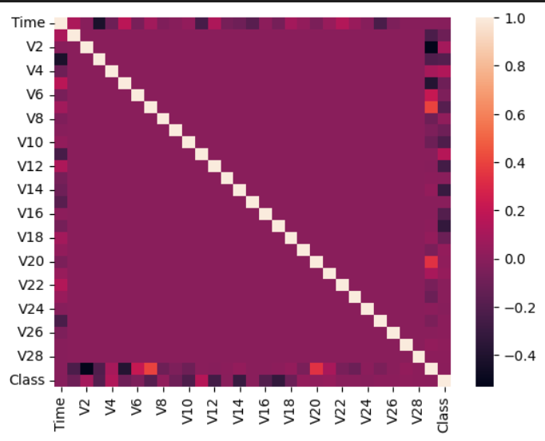
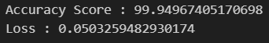

# Credit Card Fraud Detection
## Overview
This project aims to detect fraudulent credit card transactions using machine learning. The dataset used is `CreditCard.csv`, and the model is implemented in the Jupyter notebook `CCFDetection.ipynb`. The project utilizes a RandomForestClassifier to avoid overfitting and achieve high accuracy.

## Dataset
- File: CreditCard.csv
- The dataset contains transactions made by credit cards in September 2013 by European cardholders. It has 31 columns including:
    - Time: Time elapsed between this transaction and the first transaction in the dataset.
    - V1 to V28: Principal Component Analysis (PCA) transformed features.
    - Amount: Transaction amount.
    - Class: Response variable (1 for fraudulent transactions, 0 for non-fraudulent transactions).
## Notebook
- File: CCFDetection.ipynb
- This notebook performs the following steps:
    - Imports the required packages
    - Data loading and preprocessing.
    - Exploratory Data Analysis (EDA).
    - Model training after partition of the data.
    - Model evaluation.
    - Prediction function for customized input.

## Instructions
### Setup
i. Clone the repository:
```bash
git clone "https://github.com/naveen-369/MLLearningOdyssey.git"
cd MLLearningOdyssey
cd Credit_Card_Fraud_Detection
```
ii. Get the dataset from [Here](https://www.kaggle.com/datasets/mlg-ulb/creditcardfraud) and place the dataset in the `Credit_Card_Fraud_Detection` Folder. The Folder Looks alike :-
```bash
Credit_Card_Fraud_Detection
|
|---CCFDetection.ipynb
|---CreditCard.csv
```
iii. Install the dependencies:

```bash
pip install pandas numpy scikit-learn matplotlib seaborn jupyter
```
iv. Open the notebook:

```bash
jupyter notebook CCFDetection.ipynb
```

### Run the Notebook
**Run all cells:** Execute the entire CCFDetection.ipynb notebook to train the model and set up the environment.

**Customized predictions:** After running the notebook, use the last cell which contains a function declaration to predict fraud on your customized input. This cell can be executed independently after the initial run.

## Model Selection
**Reason for choosing RandomForestClassifier:**
The correlation matrix showed no linear relationships between the features and the response variable,



making linear models less suitable. Decision trees can be used in this situation. In order to eliminate the overfitting issue in the decision trees, `RandomForestClassifier` is used,which helps to avoid overfitting and provides high accuracy, achieving over 99% accuracy in our case.




## Contribution
Contributions are welcome ! .
Any new Features, updates and a new effecient Model and be created and make a pull request after adding new features.

## License
This project is licensed under the MIT License. See the `LICENSE` file in the root directory for details.